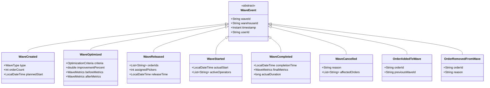

# Wave Planning Service - Domain Model

## Overview

The Wave Planning Service domain model implements sophisticated warehouse wave management using Domain-Driven Design (DDD) principles. The model centers around the Wave Aggregate, which orchestrates the grouping and optimization of orders for efficient picking.

## Class Diagram


## Entity Relationships


## Value Objects

### Location
```java
public class Location {
    private String aisle;
    private String bay;
    private String level;
    private String position;
    private Coordinates coordinates;
}
```

### Coordinates
```java
public class Coordinates {
    private double x;
    private double y;
    private double z;
    private double distanceTo(Coordinates other);
}
```

### Address
```java
public class Address {
    private String street;
    private String city;
    private String state;
    private String zipCode;
    private String country;
}
```

## Domain Events



## Aggregates and Boundaries

### Wave Aggregate
- **Root**: Wave
- **Entities**: Order (referenced)
- **Value Objects**: WaveMetrics, CarrierCutoff, WaveCapacity, Location, Address
- **Invariants**:
  - A wave can only be in one status at a time
  - Orders can only belong to one active wave
  - Wave capacity constraints must be respected
  - Cannot modify a completed or cancelled wave

### Consistency Boundaries
- Wave aggregate ensures internal consistency
- Order references are by ID only (no direct object references)
- Cross-aggregate operations use domain events
- Eventual consistency between Wave and Order aggregates

## Domain Services

### WaveOptimizationService
Primary service for wave creation and optimization:
- `optimizeWave()` - Multi-objective optimization
- `createCarrierWaves()` - Group by carrier cutoffs
- `createZoneWaves()` - Group by warehouse zones
- `createCapacityWaves()` - Respect capacity constraints
- `createTimeBasedWaves()` - Fixed time windows

### WaveAllocationService
Handles wave-to-resource allocation:
- `allocatePickers()` - Assign operators to waves
- `calculateRequiredResources()` - Resource planning
- `balanceWorkload()` - Distribute work evenly

### WaveMonitoringService
Real-time wave tracking:
- `trackProgress()` - Monitor completion status
- `calculateETA()` - Estimate completion time
- `detectBottlenecks()` - Identify slow zones
- `recommendAdjustments()` - Suggest optimizations

## Repository Interfaces

```java
public interface WaveRepository {
    Wave findById(String waveId);
    List<Wave> findByWarehouse(String warehouseId);
    List<Wave> findByStatus(WaveStatus status);
    List<Wave> findActiveWaves();
    Wave save(Wave wave);
    void delete(String waveId);
}

public interface OrderRepository {
    Order findById(String orderId);
    List<Order> findByIds(List<String> orderIds);
    List<Order> findPendingOrders();
    List<Order> findByCarrier(String carrier);
    List<Order> findByZone(String zone);
}
```

## Business Rules

1. **Wave Creation Rules**
   - Minimum 10 orders per wave (configurable)
   - Maximum 100 orders per wave (capacity-based)
   - Cannot exceed picker capacity
   - Must respect carrier cutoff times

2. **Wave Status Transitions**
   ```
   DRAFT -> PLANNED -> RELEASED -> IN_PROGRESS -> COMPLETED
                  \-> CANCELLED
   ```

3. **Optimization Constraints**
   - Balance travel distance vs. SLA priority
   - Group orders by zone when possible
   - Respect carrier service level agreements
   - Maintain picker workload balance

4. **Capacity Management**
   - Volume capacity: 1000 cubic feet default
   - Weight capacity: 5000 lbs default
   - Line capacity: 500 lines default
   - Picker capacity: Based on availability

## Performance Considerations

- Wave optimization runs asynchronously for large waves (>50 orders)
- Metrics are cached and updated incrementally
- Zone data is preloaded for optimization algorithms
- Distance calculations use Manhattan distance for speed