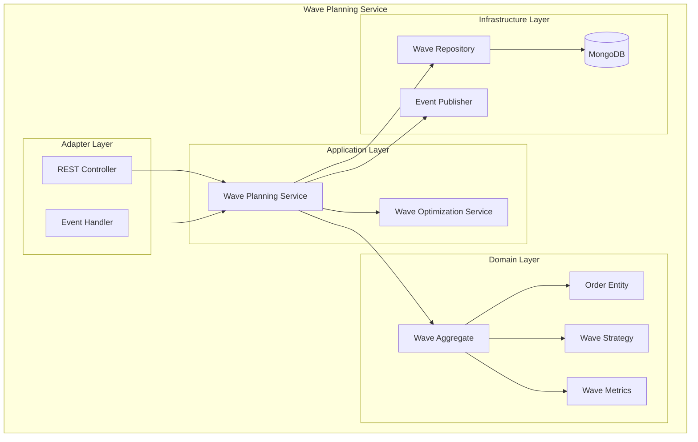

# Wave Planning Service Documentation

## Overview

The Wave Planning Service is responsible for creating, optimizing, and managing warehouse picking waves. It implements sophisticated algorithms to group orders efficiently based on various strategies including carrier cutoffs, zone optimization, and capacity constraints.

## Table of Contents

1. [Architecture Overview](#architecture-overview)
2. [Domain Model](#domain-model)
3. [API Documentation](#api-documentation)
4. [Sequence Diagrams](#sequence-diagrams)
5. [Class Diagrams](#class-diagrams)
6. [Integration Points](#integration-points)
7. [Configuration](#configuration)

## Architecture Overview



## Quick Start

```bash
# Run the service
mvn spring-boot:run

# Run tests
mvn test

# Build Docker image
mvn spring-boot:build-image
```

## Key Features

- **Multi-Strategy Wave Creation**: Time-based, carrier-based, zone-based, capacity-based
- **Wave Optimization**: Multi-objective optimization for travel distance, workload, and SLA
- **Real-time Event Processing**: Reacts to order events and inventory changes
- **Carrier Cutoff Management**: Ensures orders meet shipping deadlines
- **Zone-based Optimization**: Groups orders by warehouse zones
- **Capacity Management**: Respects picker and volume constraints

## Technology Stack

- Java 21
- Spring Boot 3.2
- MongoDB
- Apache Kafka
- Maven

## Contact

- Service Owner: WMS Team
- Slack: #wms-wave-planning