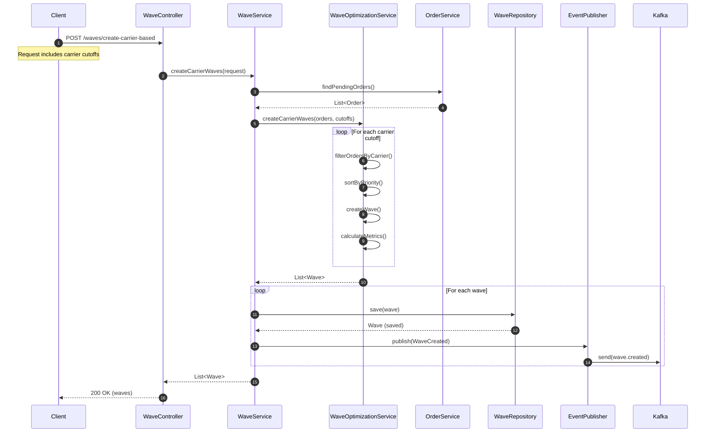
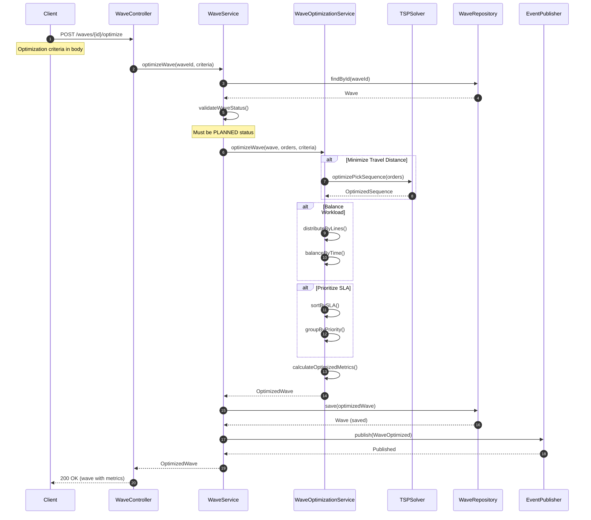
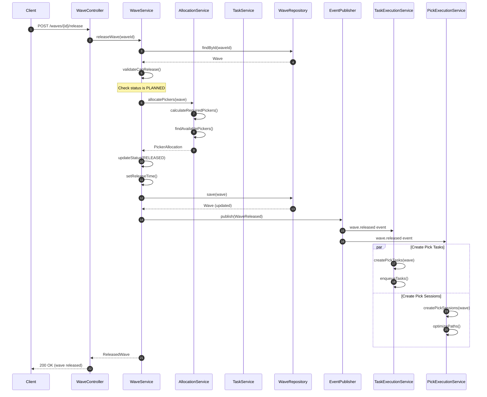
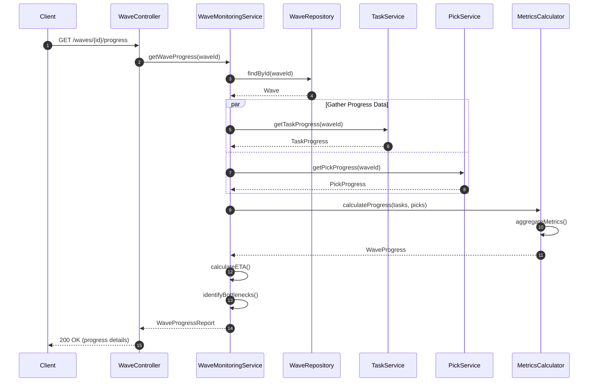
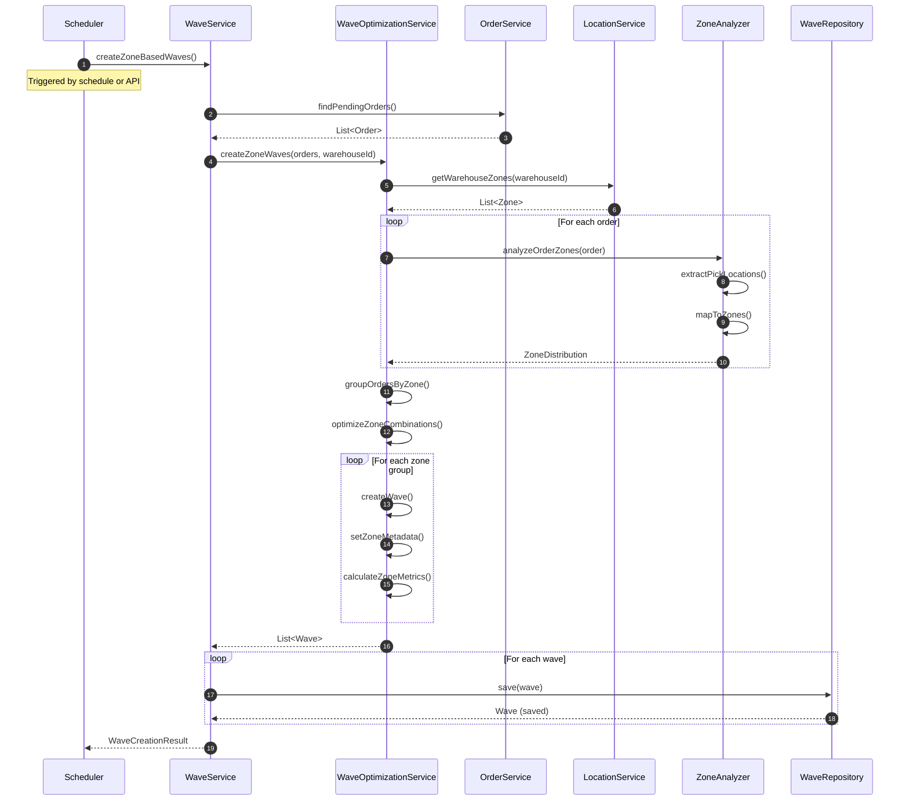
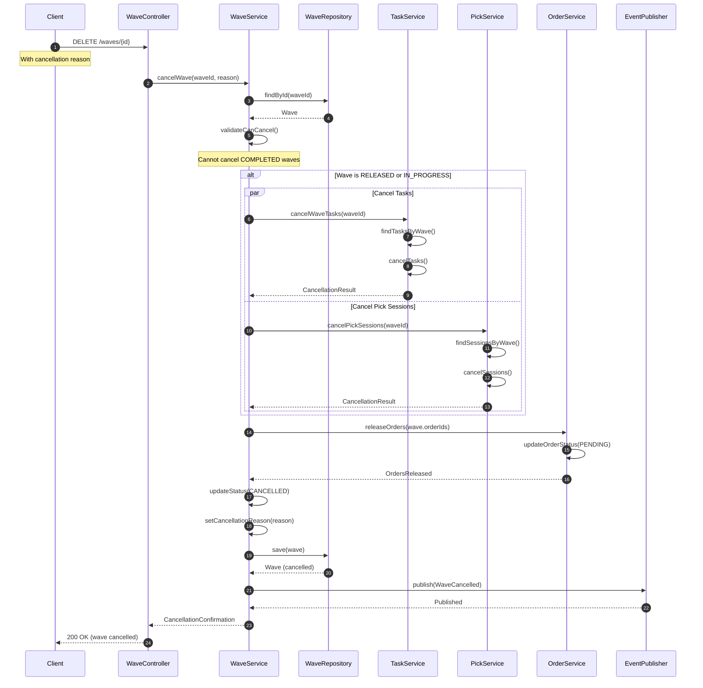
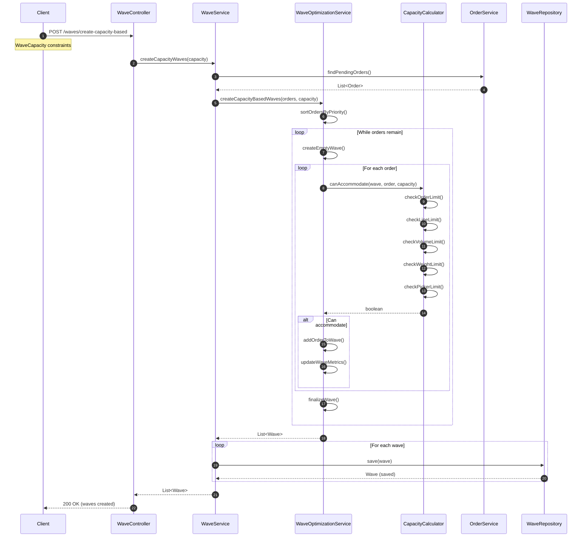
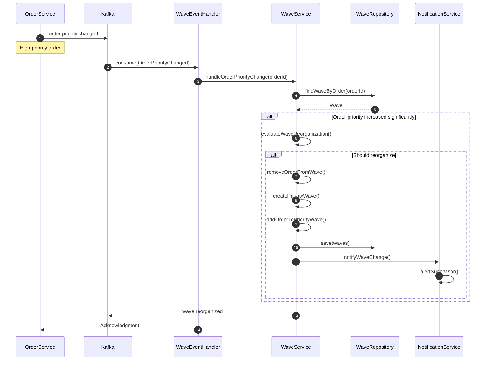
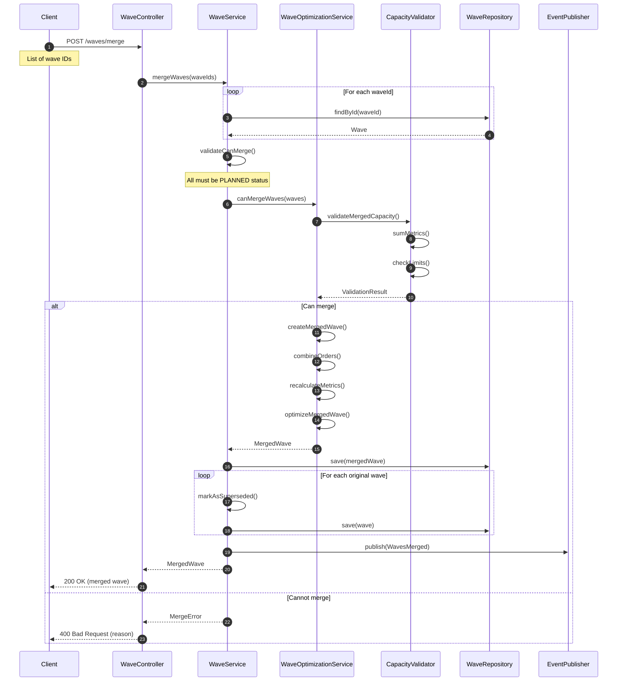
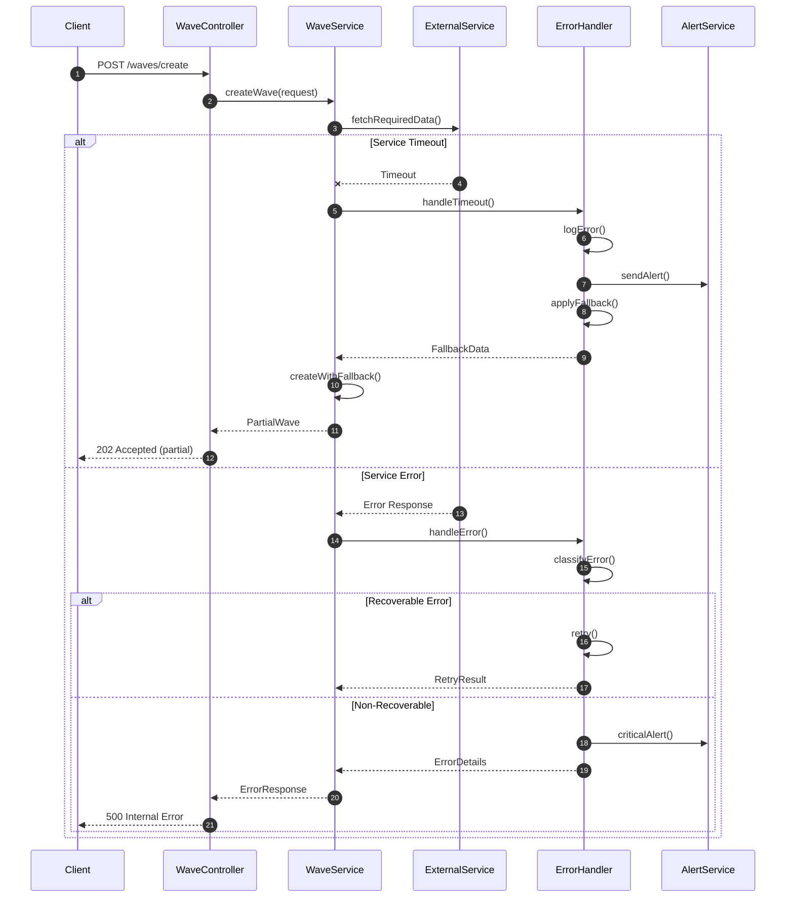

# Wave Planning Service - Sequence Diagrams

## 1. Wave Creation and Optimization Flow

### Create Carrier-Based Wave

### Optimize Existing Wave

## 2. Wave Release and Execution Flow

### Release Wave for Picking

### Monitor Wave Progress

## 3. Zone-Based Wave Creation Flow

## 4. Wave Cancellation Flow

## 5. Capacity-Based Wave Creation Flow

## 6. Event-Driven Wave Updates

## 7. Wave Merge Operation

## Error Handling Patterns

## Key Interaction Patterns

1. **Asynchronous Processing**: Large wave optimizations are processed asynchronously
2. **Event Sourcing**: All state changes emit events for downstream services
3. **Compensation**: Failed operations trigger compensation transactions
4. **Circuit Breaker**: External service calls use circuit breaker pattern
5. **Retry Logic**: Transient failures are retried with exponential backoff
6. **Idempotency**: All operations are idempotent using request IDs