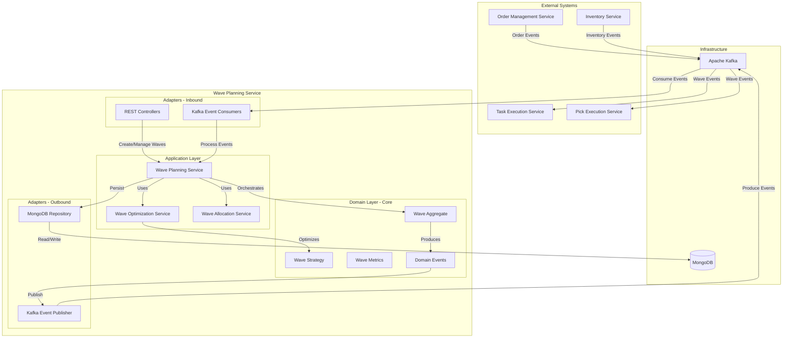
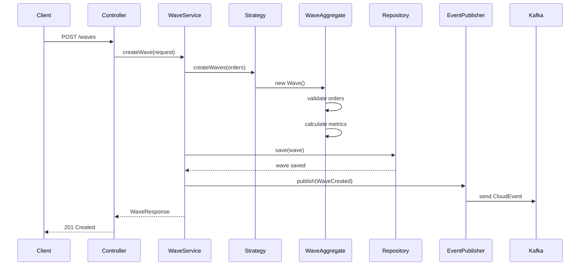
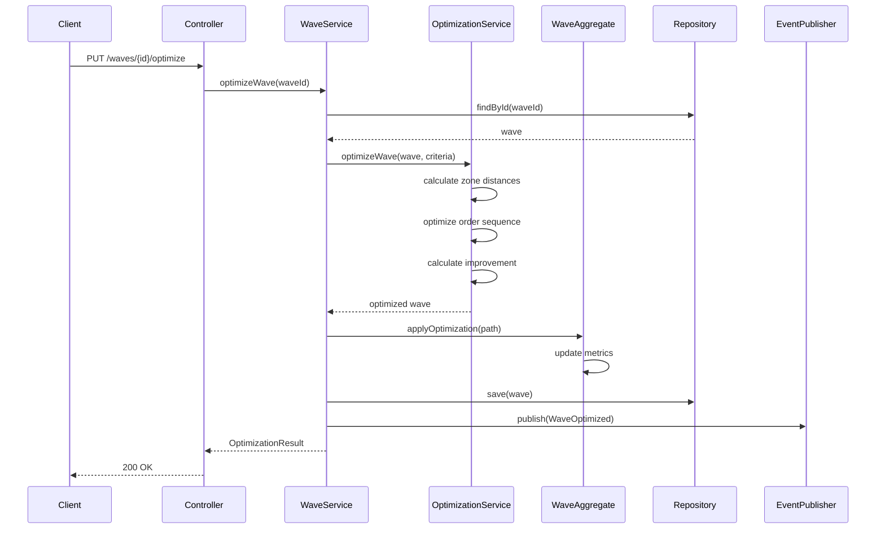
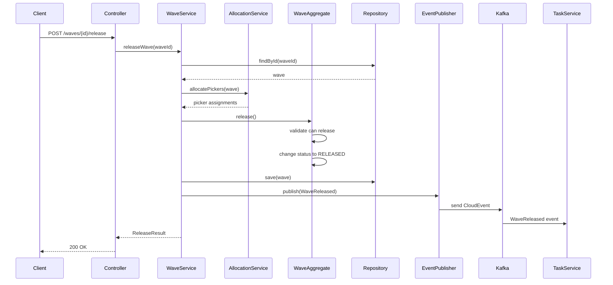

# Wave Planning Service - Architecture

This document provides a comprehensive overview of the Wave Planning Service architecture, following the Hexagonal Architecture (Ports and Adapters) pattern with Domain-Driven Design principles.

## High-Level System Architecture



## Hexagonal Architecture Layers

### Adapters Layer (Inbound)

#### REST Controllers
- `WaveController` - Wave management endpoints
- `WaveOptimizationController` - Optimization endpoints
- Request validation and transformation
- OpenAPI documentation

#### Kafka Event Consumers
- `OrderEventConsumer` - Processes order validated events
- `InventoryEventConsumer` - Processes inventory reserved events
- CloudEvents deserialization
- Event routing to application services

### Application Layer

#### Wave Planning Service
Core orchestration service for wave operations:
- `createWave(WaveRequest)` - Create new wave
- `optimizeWave(String waveId)` - Optimize existing wave
- `releaseWave(String waveId)` - Release wave to warehouse
- `cancelWave(String waveId)` - Cancel wave
- `addOrderToWave(String waveId, String orderId)` - Add order
- `removeOrderFromWave(String waveId, String orderId)` - Remove order

#### Wave Optimization Service
Advanced optimization algorithms:
- `optimizeWavePath(Wave)` - Multi-objective optimization
- `createCarrierWaves(List<Order>)` - Carrier-based grouping
- `createZoneWaves(List<Order>)` - Zone-based grouping
- `createCapacityWaves(List<Order>)` - Capacity-constrained grouping
- `createTimeBasedWaves(List<Order>)` - Time window grouping

#### Wave Allocation Service
Resource allocation management:
- `allocatePickers(Wave)` - Assign operators to wave
- `calculateRequiredResources(Wave)` - Resource planning
- `balanceWorkload(List<Wave>)` - Distribute work evenly

### Domain Layer (Core)

#### Wave Aggregate
Root entity managing complete wave lifecycle:
- State management (DRAFT, PLANNED, RELEASED, IN_PROGRESS, COMPLETED, CANCELLED)
- Order collection management
- Metrics calculation
- Business rule enforcement
- Domain event generation

#### Wave Strategy (Interface)
Strategy pattern for wave creation:
- `TimeBasedStrategy` - Fixed time windows
- `CarrierBasedStrategy` - Carrier cutoff grouping
- `ZoneBasedStrategy` - Warehouse zone grouping
- `CapacityBasedStrategy` - Capacity constraint grouping
- `PriorityBasedStrategy` - SLA and priority grouping

#### Wave Metrics (Value Object)
Wave performance metrics:
- Total orders, lines, units
- Total volume and weight
- Estimated pickers and duration
- Total distance
- Orders by zone and carrier

### Adapters Layer (Outbound)

#### MongoDB Repository
Persistence implementation:
- `WaveRepository` - Wave aggregate persistence
- `OrderRepository` - Order reference queries
- Optimistic locking for concurrency
- Index management for performance

#### Kafka Event Publisher
Event publication with transactional outbox:
- CloudEvents format
- Guaranteed delivery
- Event ordering
- Retry logic

## Data Flow Diagrams

### Wave Creation Flow



### Wave Optimization Flow



### Wave Release Flow



## Technology Stack Details

### Core Technologies
- **Java 21** - Latest LTS with virtual threads support
- **Spring Boot 3.2** - Application framework with auto-configuration
- **Spring Data MongoDB** - Document persistence
- **Spring Kafka** - Event streaming integration
- **Maven** - Build and dependency management

### Key Dependencies
- **CloudEvents SDK 2.5.0** - Event format standard
- **Jackson** - JSON serialization
- **Lombok** - Boilerplate reduction
- **MapStruct** - Object mapping
- **SpringDoc OpenAPI** - API documentation

### Testing Stack
- **JUnit 5** - Testing framework
- **Mockito** - Mocking framework
- **Testcontainers** - Integration testing with MongoDB and Kafka
- **AssertJ** - Fluent assertions

## Database Design

### Wave Collection Schema

```json
{
  "_id": "wave-12345",
  "warehouseId": "warehouse-1",
  "status": "PLANNED",
  "type": "ZONE_BASED",
  "createdAt": "2025-10-19T10:00:00Z",
  "plannedStartTime": "2025-10-19T14:00:00Z",
  "plannedEndTime": "2025-10-19T18:00:00Z",
  "orderIds": ["order-1", "order-2", "order-3"],
  "metrics": {
    "totalOrders": 3,
    "totalLines": 45,
    "totalUnits": 120,
    "totalVolume": 250.5,
    "totalWeight": 450.2,
    "estimatedPickers": 2,
    "estimatedDuration": 14400,
    "totalDistance": 1500.0,
    "ordersByZone": {
      "A1": 2,
      "B2": 1
    },
    "ordersByCarrier": {
      "FedEx": 2,
      "UPS": 1
    }
  },
  "metadata": {
    "optimizationCriteria": "ZONE_OPTIMIZED",
    "createdBy": "system"
  },
  "version": 1
}
```

### MongoDB Indexes

```javascript
// Primary index
db.waves.createIndex({ "_id": 1 })

// Query indexes
db.waves.createIndex({ "warehouseId": 1, "status": 1 })
db.waves.createIndex({ "warehouseId": 1, "plannedStartTime": 1 })
db.waves.createIndex({ "status": 1, "plannedStartTime": 1 })

// Compound index for active waves
db.waves.createIndex({
  "warehouseId": 1,
  "status": 1,
  "plannedStartTime": 1
})
```

## Event Schema

### WaveCreated Event (CloudEvents Format)

```json
{
  "specversion": "1.0",
  "type": "com.paklog.wave.created",
  "source": "wave-planning-service",
  "id": "event-uuid",
  "time": "2025-10-19T10:00:00Z",
  "datacontenttype": "application/json",
  "data": {
    "waveId": "wave-12345",
    "warehouseId": "warehouse-1",
    "type": "ZONE_BASED",
    "orderCount": 3,
    "plannedStart": "2025-10-19T14:00:00Z",
    "estimatedPickers": 2,
    "metrics": {
      "totalOrders": 3,
      "totalLines": 45
    }
  }
}
```

### WaveReleased Event

```json
{
  "specversion": "1.0",
  "type": "com.paklog.wave.released",
  "source": "wave-planning-service",
  "id": "event-uuid",
  "time": "2025-10-19T12:00:00Z",
  "datacontenttype": "application/json",
  "data": {
    "waveId": "wave-12345",
    "warehouseId": "warehouse-1",
    "orderIds": ["order-1", "order-2", "order-3"],
    "assignedPickers": 2,
    "releaseTime": "2025-10-19T12:00:00Z",
    "estimatedCompletion": "2025-10-19T18:00:00Z"
  }
}
```

## Configuration Management

### Application Properties

```yaml
# Server Configuration
server:
  port: 8080

# MongoDB Configuration
spring:
  data:
    mongodb:
      uri: mongodb://localhost:27017/wave-planning
      auto-index-creation: true

# Kafka Configuration
spring:
  kafka:
    bootstrap-servers: localhost:9092
    consumer:
      group-id: wave-planning-service
      auto-offset-reset: earliest
    producer:
      key-serializer: org.apache.kafka.common.serialization.StringSerializer
      value-serializer: io.cloudevents.kafka.CloudEventSerializer

# Wave Planning Configuration
wave:
  min-orders: 10
  max-orders: 100
  optimization:
    max-iterations: 100
    improvement-threshold: 0.01
  capacity:
    volume: 1000.0
    weight: 5000.0
    lines: 500
```

## Error Handling Strategy

### Domain Exceptions
- `WaveNotFoundException` - Wave not found
- `InvalidWaveStateException` - Invalid state transition
- `WaveCapacityExceededException` - Capacity limit exceeded
- `OrderAlreadyInWaveException` - Order already assigned

### Exception Handling
- Global exception handler with @ControllerAdvice
- Structured error responses with problem details (RFC 7807)
- Logging with correlation IDs
- Circuit breakers for external service calls

## Security Considerations

### Authentication & Authorization
- JWT-based authentication
- Role-based access control (RBAC)
- Service-to-service authentication via mTLS

### Data Protection
- Encryption at rest (MongoDB)
- Encryption in transit (TLS)
- Sensitive data masking in logs
- Audit trail for all wave modifications

## Monitoring and Observability

### Metrics (Micrometer)
- Wave creation rate
- Optimization duration
- Wave completion time
- Order per wave average
- Event processing lag

### Logging (SLF4J + Logback)
- Structured JSON logging
- Correlation ID propagation
- Log levels per package
- Centralized log aggregation

### Tracing (OpenTelemetry)
- Distributed tracing across services
- Span instrumentation
- Trace context propagation in events

### Health Checks
- Spring Boot Actuator endpoints
- MongoDB connection health
- Kafka connection health
- Custom business health indicators

## Performance Optimization

### Caching Strategy
- Wave details cached (15 minutes TTL)
- Order data cached (5 minutes TTL)
- Zone distance matrix cached (1 hour TTL)
- Carrier cutoff times cached (30 minutes TTL)

### Async Processing
- Wave optimization runs asynchronously for large waves (>50 orders)
- Event publishing is asynchronous
- Batch wave creation for efficiency

### Database Optimization
- Indexed queries for fast lookups
- Projection queries to fetch only required fields
- Connection pooling for MongoDB
- Read preference for reporting queries

## Scalability Approach

### Horizontal Scaling
- Stateless application design
- Kafka consumer groups for parallel processing
- Load balancing across multiple instances

### Vertical Scaling
- Configurable thread pools
- JVM tuning for large heap sizes
- Virtual threads for I/O operations

## Disaster Recovery

### Backup Strategy
- MongoDB automated backups (daily)
- Point-in-time recovery capability
- Kafka topic retention (7 days)

### Failover
- Multi-AZ deployment
- Automatic failover for MongoDB replica set
- Kafka cluster with replication factor 3
